# wpfThreads

### introduce per la prima volta xaml, più facile da imparare e vicino allo xamarin

cucchi.iacopo.4i.wpfbase .NET 6.0 -> creazione del progetto su vs 2022
Con soluzione - apri cartella in esplora file -> per trovare esattamente dov’è il nostro progetto, per le consegne bisogna consegnare l’intera cartella

dentro bin e obj ci sono i file compilati
### 
Visual studio ci divide lo schermo in zona sopra e sotto, per recuperare spazio eliminare parti inutili, con il tasto comprimi vediamo l’anteprima senza il codice di intralcio.
Tag di apertura di windows contiene all’ interno tanti attributi
### 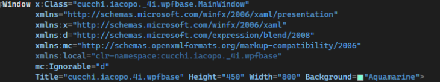

"cucchi.iacopo.4i.wpf base" -> nel Title inserire il nome del progetto
visualizza altre finestre poi altre proprietà per far apparire la finestra per la gestione delle proprietà

Le proprietà al posto di catalogarle per categoria le disponiamo per nome, in fondo abbiamo windowstartupLocation.

WindowstartupLocation =”CenterScreen”> Se abbiamo quattro monitor ci farà apparire l’anteprima al centro dei quattro monitor.

Controllare sempre la scrittura corretta del codice che inseriamo, dopo = controllare la presenza dei “”.

09/02/2022
cucchi.iacopo.4i.wpf Threads ->public MainWindow()
        {
            InitializeComponent();
        }
serve per accedere a tutti i componenti.
THREAD
un piccolo programma che gira in maniera autonoma ma dipende dal processo principale
### 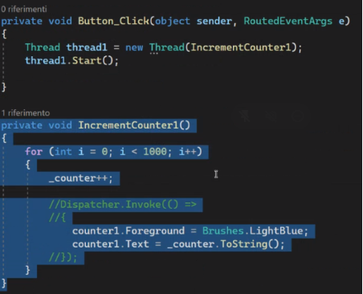
MainWindow all'interno di esso verrà lanciato il thread
private int_counter =0 -> variabile globale, variabile di istanza "counter" di tipo intero (int) e inizializzata con il valore 0.

Dispatcher.Invoke
E’ un metodo che consente di eseguire codice nel thread dell'interfaccia utente da un thread in background. Permette di accedere ai controlli dell'interfaccia utente esclusivamente dal thread che li ha  creati, solitamente il thread dell'interfaccia utente, permette a un thread di accedere al lbl Counter 1.
Thread 1 non  riesce ad accedere al lbl Counter 1
### 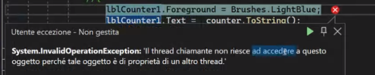
wrapping(zona critica)metodo che contiene parametri al suo interno: 
lambda expression, simbolo di lambda => 
### 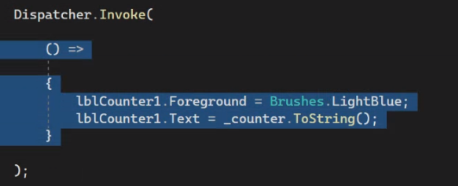

Comando per determinare la sospensione del thread corrente per un periodo di tempo specificato, in questo caso 50 millisecondi:
### 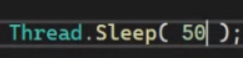
Processo bloccante
Un processo bloccante è un processo che impedisce ad altri processi di eseguire codice mentre esso è in esecuzione, perché il processo bloccante richiede l'accesso a una risorsa che non è disponibile o non può essere utilizzata simultaneamente da più processi, quando c'è un processo bloccante c’è il blocco del processo del user interface, l’applicazione non risponde “lagga”.

16/02/2023
Creazione di un nuovo thread tramite il codice:
lbl Counter 1.Text=x.ToString(); -> la variabile x viene convertita in una stringa utilizzando il metodo ToString()  
### 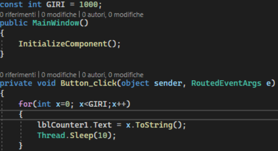

il processo lento da lanciare diventa:
### 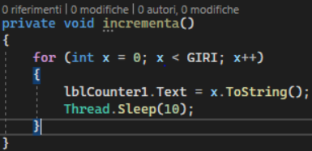

Creazione di un nuovo thread e dopo lo start la parte di codice continua a girare e la UI non si ferma:
### 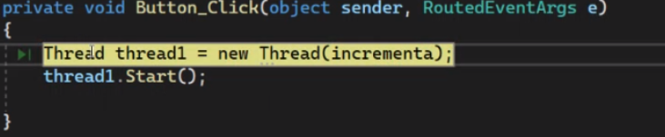

Il thread principale lancia un altro thread.

Più thread lavorano sulla stessa variabile:
### 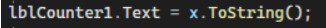

### 
:
Quando si chiama il metodo Thread.Abort, il sistema operativo segnala al thread di terminare il più velocemente possibile.

Risultato di due metodi incrementa con due valori differenti nel Thread.sleep():
### 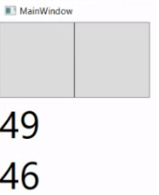
### 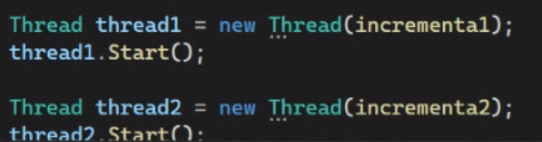

02/03/2023

Problema che eseguendo il codice abbiamo incontrato:Il primo metodo incrementa 1 fa 500 giri e il secondo metodo incrementa 2 ne fa 1000 alla fine del counter il risultato però è 1500 sulla mainwindow, perchè il problema rilevato non è di conteggio, quando si ferma il contatore da 500 giri non si ferma a 500 giri perchè nessuno aggiorna più la label e quindi continuerà a fare giri aggiuntivi.
### 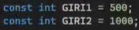

Due costanti 
### 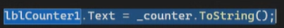

### 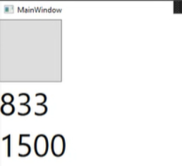
Risultato dell’esecuzione del codice

SEMAFORO
un intero che non può essere negativo costrutto che si trova nella parte più bassa del sistema operativo, lock -> Ogni oggetto ha un lock che può essere controllato da un solo Thread.L'acquisizione di un Thread consente l’accesso al codice, se il Thread è libero il Thread corrente può acquisirlo.WAIT/SIGNAL: un'operazione wait() sul semaforo e decrementa il valore del semaforo da 1 a 0. Quando rilascia la risorsa, esegue un'operazione signal() sul semaforo e incrementi il suo valore su 1.
### 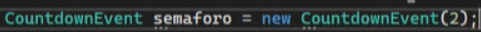

Creazione di un semaforo (2) -> indica a quanto lo carichiamo

### 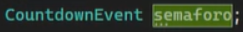
variabile semaforo

### 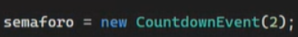
inizializzazione di un semaforo

### 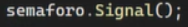
segnale che il lavoro svolto è terminato

### 
wait blocca completamente, non fa come il comando .sleep che fa laggare per poi ripartire

### 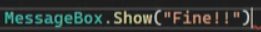
Messaggio finale

### 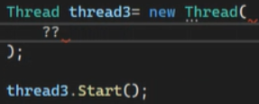
Creazione del 3 thread, per evitare di creare
un nuovo metodo incrementa 3.

### 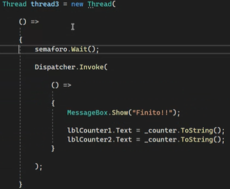
simbolo di lambda l'operatore di dichiarazione lambda => per separare l'elenco di parametri dell'espressione lambda dal corpo., può essere passata a thread come parametro perché c’è una lambda expression.

Solitamente si trovano in questo formato:
### 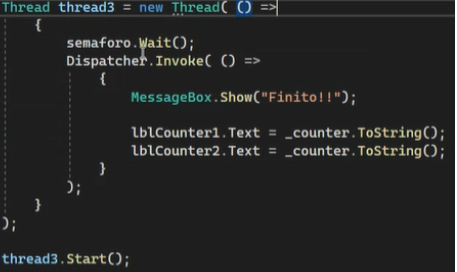

### 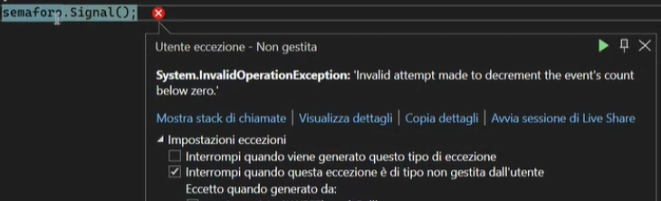

Sono venuti a meno i reference del semaforo, non possiamo cliccare più volte sul botton perché altrimenti si blocca tutto.

### 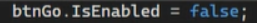
spegne momentaneamente il pulsante, quando ha finito il pulsante risulta acceso non si può più cliccare il bottone durante i giri nel mainwindow.

09/03/2023
### 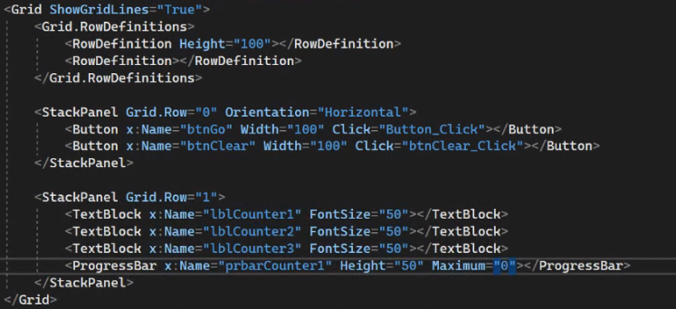
ProgressBar: si usa per visualizzare l'andamento di un'operazione in corso, i valori minimo e massimo possono essere inseriti riguardo alla barra di avanzamento e quindi aggiornare il valore corrente man mano che l'operazione avanza. In questo modo, la barra di avanzamento si riempirà gradualmente fino a raggiungere il valore massimo quando l'operazione sarà completa.

Esempi di codice affrontati in classe da cui poter prendere spunto per poter completare l’esercizio assegnato:
### 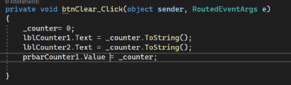
### 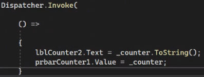
### 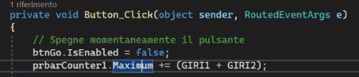
### 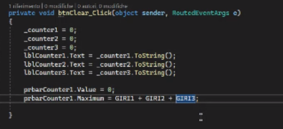
### 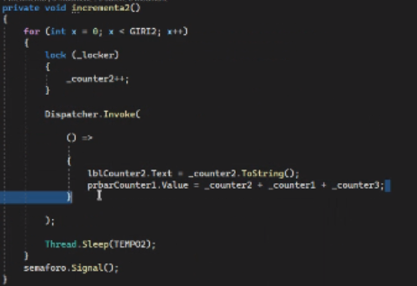

3 volte backtick per inserire codice in maniera giusta

